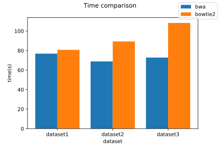
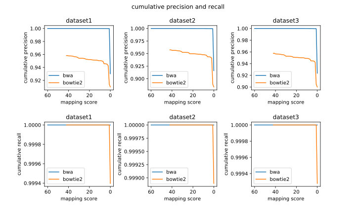
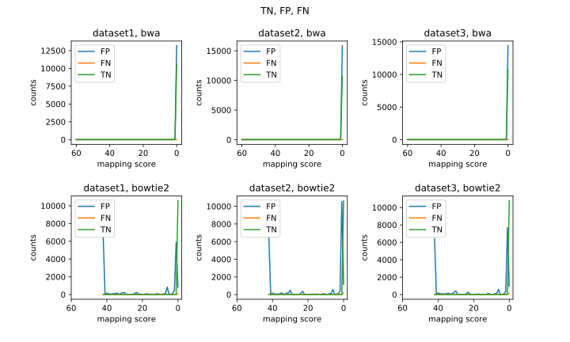

# BME1063 Homework1 report
**潘修齐 2018522077**

[TOC]

## Data Preparation

### Data Overview

The fastq data is generated by the software [dwgsim](https://github.com/nh13/DWGSIM) written by `Nils Homer`. The parameters are set as default except the sequencing error rate (in order to simulate high-quality sequencing data, mimicing real data). 3 pair-end datasets are generated based on human genome `hg38` with different read length, namely 50, 70 and 100 bp respectively.

### data regeneration

To regenerate the data, run pbs file on `PBS/HW1-1_DataSimulation/HW1-1_DataSimulation.pbs`

```shell
qsub PBS/HW1-1_DataSimulation/HW1-1_DataSimulation.pbs

# for personal computer, run as shell script:
# bash PBS/HW1-1_DataSimulation/HW1-1_DataSimulation.pbs
```

### detailed parameters

| parameter | value |
|-----------|-------|
| error rate | 0.0007 (quality score ~31.5) |
| number of reads | 100000 |
| random seed | 1063 (course number) |
| outer distance between two ends for pairs | mean 500, stddev 50|
| mutation rate | 0.1% |
| indel fraction | 0.1 |
| random DNA read fraction | 5% |
| number of Ns in a read | maximum 0 |
| stddev for base quality score | 50 |

### DataQC

To show the quality of the data simulated, fastqc was performed upon the data generated. To regenerate QC process, run pbs script `PBS/HW1-2_FASTQC/HW1-2_FASTQC.pbs`

```shell
qsub PBS/HW1-2_FASTQC/HW1-2_FASTQC.pbs

# for personal computers, run as shell script:
# bash PBS/HW1-2_FASTQC/HW1-2_FASTQC.pbs
```

The QC result can be found on `FinalReport/FASTQC`, all simulated data shows good quality.

## Results

Simulated data is aligned to reference genome `hg38` with bwa and bowtie2. Both softwares use a pre-index strategy to speed up the alignment process. For `bwa`, the index is generated using 10-core, 32 Gb ram on HPC. For `bowtie2`, the index is downloaded from the official website.

### Time summary

Time summary is extracted by a script `script/1-time_summary.sh`

```shell
bash script/1-time_summary.sh 
```

The running time (user time) of two softwares are as follows: 

| dataset | BWA time | Bowtie2 time |
|---------|----------|--------------|
| dataset1 | 1m17s   | 1m21s        |
| dataset2 | 1m9s    | 1m29s        |
| dataset3 | 1m13s   | 1m48s        |

Using code in `script/2-vidualization_analyzation.ipynb`, a visualization can be generated as follows:



As is shown above, BWA and bowtie2 have a similar running time for dataset1. However, as the read length getting longer, BWA running time stays constant while bowtie2 require more time to perform alignment.

### mapping quality summary

The mapping quality information is summarized by calling `dwgsim_eval`, which is a component of `dwgsim`. By running `script/3-map_quality_summary.sh`, tab-splitted summary files will be generated on `FinalReport/mapping_summary`

The further analyzation and visualization is done by jupyter notebook `script/2-vidualization_analyzation.ipynb`

The precision and recall is computed as follows:

|software | dataset | precision | recall | Fscore |
|---------|---------|-----------|--------|--------|
|bwa|dataset0 | 0.930225 | 1.0 | 0.963852 |
| bowtie2 | dataset1 | 0.909904 | 0.999397 | 0.952553 |
| bwa | dataset1 | 0.915926 | 1.0 | 0.956119 |
| bowtie2 | dataset2 | 0.883572 | 0.998894 | 0.937701 |
| bwa | dataset2 | 0.923573 | 1.0 | 0.960268 |
| bowtie2 | dataset3 | 0.900112 | 0.999278 | 0.9471060 |

Generally, bwa does a better job than bowtie2.

### Cumulative precision and recall

Since both software provide with mapping a mapping quality score, it is informative to see the mapping quality with some mapping quality score threshold. Here a cumulative precision and recall was defined as follows:

$$
\mbox{Cumulative precision} = \frac{\mbox{TP considering cases with score higher than threshold}}{\mbox{TP + FP considering cases with score higher than threshold}} 
$$

$$
\mbox{Cumulative recall} = \frac{\mbox{TP considering cases with score higher than threshold}}{\mbox{TP + FN considering cases with score higher than threshold}}
$$

The following figure visualizes the cumulative precision and recall of two softwares. Note that different softwares have different quality score system, and thus quality scores produced by different softwares cannot be compared with each other.



## Discussion

### Cause of time differences

As we can see, BWA runs with constant time with 3 different datasets while bowtie2's running time varies between different datasets. Since the only difference between the datasets is the sequencing read length, we can predict that Bowtie2 requires longer running time for longer sequencing reads while BWA do not. This phenomenon is caused by the algorithms applied by the two softwares.

For BWA, alignment is based on Burrows-Wheeler Transform. Starting from the whole reference genome, the search space for BWA get smaller by each round. In average, for every round, 3 forths of the reference genome is eliminated, leading to a time complexity of $ O(nlog_4(N)) $ for each reads, N being the size of the Genome and n being the number of reads. Since $ 4^50 \approx 10^{30} $ is a large number, well exceding the size of human reference genome, the alignment will terminate before running out of read length. As a result, time consumption for BWA alignment is determined by the reference genome size and is unrelated with read length.

For bowtie2, a 4-steps alignment process is implemented. The first sterp for Bowtie2 to align a single read is generating "seed" substrings for every 10 bp of the query string, and thus the number of seeds is proportional to the length of query read. After that, Burrows Wheeler alignment was performed to align the seeds to the reference genome, followed by extension using dynamic programming algorithm. Because of the increasing number of seeds with query length and quadratic complexity of dynamic programming algorithm, the time spent will get longer for mapping longer reads, being $ O(mnN) $. (m being the read length, n being number of reads and N being the refenrece size)

### Mapping quality Score

As we can observe by `cumulative precision and recall`, bad mappings are clustered at around 0 score, escpeciall for BWA. In fact, If we can plot FP, TN, FN against the mapping quality score, we will find that those events all happen with relatively low quality score, proving the scoring system reasonable.



### Possible reasons for mistakes

The most common mistake is False positive, and as is recorded in  `script/2-vidualization_analyzation.ipynb`, there is no random sequences mapped, thus the most common mistake being mis-mapping. It is found that mistakes can happen when the read comes from repetative regions.

we take one mismapped read as an example:

`chr1_122619406_122619831_0_1_0_0_0:0:0_0:0:0_4b9`

This read is from dataset3, originating in chromosome 1, position 122619406. It is mapped to position 25024848 at chromosome 19 by bwa and position 123137299 at chromosome 1 by bowtie2.

The raw sequence is: `TATTCACCTCACCGATTTGAACGATCCTTTACACAGAGCAGACTTGAAACACTCTTTTTGTGGAATTTGCAAGTGGAGATTTCAGCCGCTTTGAGGTCAA`

By searching the sequence using [Human BLAT Search](https://genome.ucsc.edu/cgi-bin/hgBlat) provided by UCSC,  the result is as follows:


The sequence actually comes from a satellite DNA region, ALR/Alpha. It is a highly repetitive region in the genome and makes it difficult for aligners to map correctly. For such cases, one can adjust parameters to allow one read to be mapped to multiple regions. For BWA, use `BWA aln -N`. For Bowtie2, use `bowtie2 -a`

### Recommandations

Due to the equally fast speed and more accurate mapping performance, BWA is recommanded for short-reads alignment.

